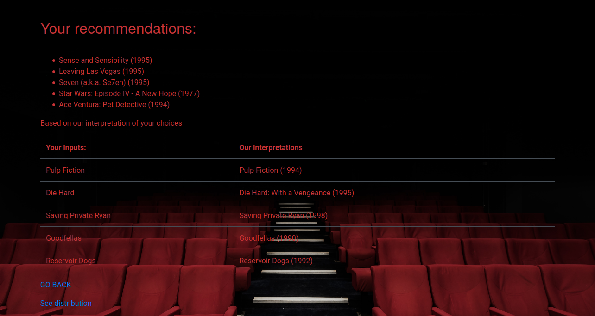

# flannflix
Movie recommender implemented through Flask, with PostGres, SQLalchemy, Dask, Scikit-learn and Altair.

## Features
* Uses PostGres's *full-text* search through *SQLalchemy* to match user-input to films in the database;
* Collaborative filtering (**non-negative factorisation**, NMF) with scikit-learn to make recommendations;
* Distributed handling of ratings matrix with Dask;
* Flask web-interface;
* CSS from Bootstrap;
* Script to generate recommendations for randomised user inputs. Allows insights into which films are recommended most frequently and demonstrates that the same films aren't recommended all the time. The results are displayed in an interactive *Altair* plot through the web-interface.

## Dataset:
* MoviesLens 100K dataset (https://grouplens.org/datasets/movielens/100k/).

## Images:

Requires PostgreSQL.
